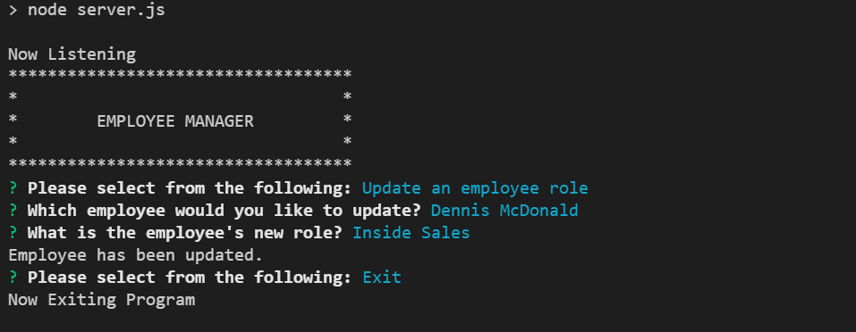

# Employee Tracker

## Description

This npm app will allow you see departments, employees, and roles in an organized format.  You can also freely change any of the entries to update the database.

#Table of Contents

- [Installation](#installation)
- [Usage](#usage)
- [Credits](#credits)
- [License](#license)
- [Tests](#tests)
- [Questions](#questions)

## Installation

all dependencies are already listed in the package.json.  Run npm install, and all the needed software will be installed.

## Usage

After running the app (npm start), you can then choose where you want to go. When adding or updating, you will be given options and inputs for entry.

## Credits

Daniel Holland, with inspiration from https://github.com/nicolewallace09/employee-tracker/blob/master/server.js

## License

MIT

## Tests

## Questions

Please check out my Github, and message me for any issues, suggestions, or questions!

https://github.com/Seyaryu
    